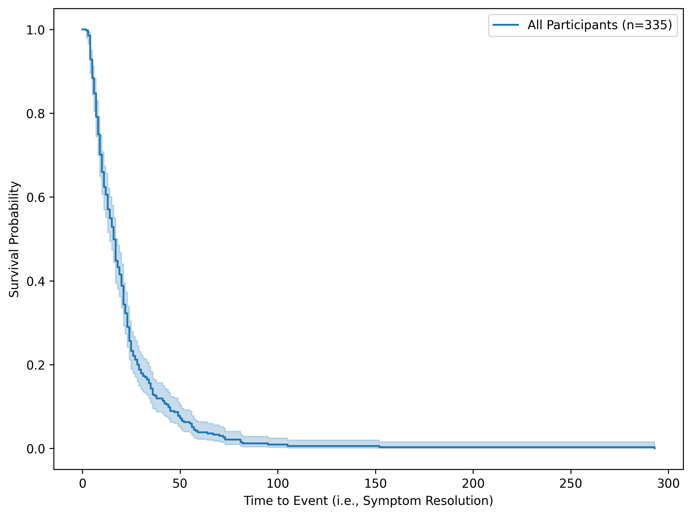
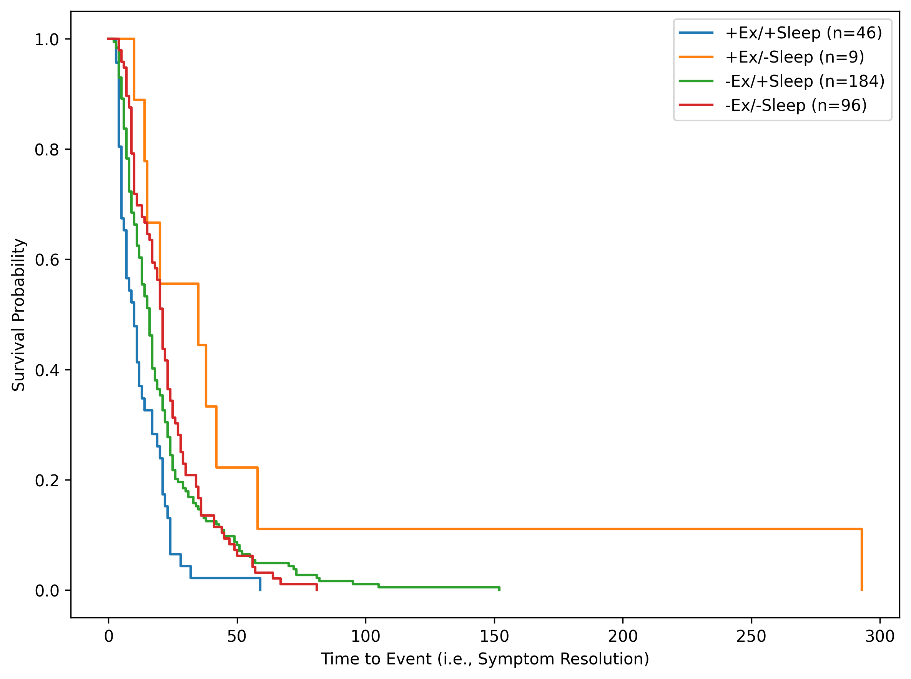
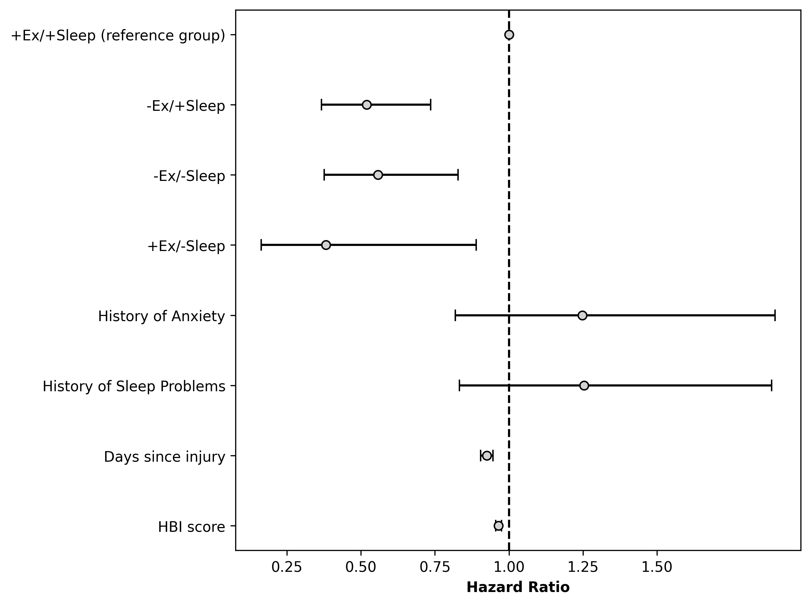

# The combined effect of sleep and exercise on adolescent patients recovering from concussion
Wingerson, MJ  
mat.wingerson@gmail.com

# Description 
Transparency of source code and results for a manuscript submitted to [journal tbd]. 

[Add citation when accepted]

**Presented at...**  
Wingerson MJ, Seehusen CN, Smulligan KL, Wilson JC, Howell DR. Combined effect of sleep and exercise soon after concussion on symptom duration among adolescents. 6th International Consensus Conference on Concussion in Sport. October 27 – 28, 2022. Amsterdam, Netherlands. Poster presentation.

---

# Overview

## Background:

The primary focus of concussion rehabilitation and clinical management is to facilitate a timely resolution of symptoms, particularly among adolescent patients.[[ref]](https://bjsm.bmj.com/content/57/11/695) Evidence-based rehabilitation protocols designed to aid in symptom resolution have been previously established,[[ref]](https://bjsm.bmj.com/content/57/12/771) with the most common approach being engagement in early post-injury aerobic exercise as symptoms allow.[[ref]](https://bjsm.bmj.com/content/57/12/762). However, emerging evidence suggests other lifestyle factors may similarly affect post-concussion symptoms. For example, sleep disturbances are common among adolescents after concussion, and those who sleep better post-injury recover faster.[[ref]](https://pubmed.ncbi.nlm.nih.gov/34145161/).

Although past work has established the role of exercise and sleep in recovery, independent of each other, no research has explored the potential combined effect of sleep and exercise on post-concussion symptom resolution. 

## Objectives: 

Our primary objective was to compare symptom resolution time between adolescents with concussion who reported engaging in exercise *and* sleeping well after injury to those who reported one or neither of these pro-recovery behaviors. 

Our secondary objective was to identify demographic, medical history, and injury characteristics that predict which patients are most likely to engage in both early exercise and quality sleep post-concussion. 

---

## Statistical methods

We grouped patients based on their self-reported sleep and exercise behaviors at the patient's initial post-injury clinical visit (within 21 days of concussion). Patients indicated whether they had engaged in aerobic exercise since their injury (yes or no), and also reported whether they experienced sleep problems during the same timeframe (yes = sleeping poorly; no = sleeping well). Based on these responses, we grouped participants as exercising and sleeping well (+Ex/+Sleep), not exercising and sleeping well (-Ex/+Sleep), exercising and sleeping poorly (+Ex/-Sleep), and not exercising and sleeping poorly (-Ex/-Sleep). 

We first compared the demographic, clinical, and injury characteristics of these four groups univariately using Analysis of Variance (ANOVA) and Chi-Squared tests. Post-hoc tests were used to evaluate differences between individual groups, with p-values adjusted for multiple comparisons using Tukey's HSD. We then used Cox Proportional Hazards (Cox PH) models to compare symptom resolution time between the four groups in a time-to-event analysis. The first Cox PH model was unadjusted and included only the four groups as predictors of time to symptom resolution. The second model was adjusted to include covariates that differed univariably between groups (p<0.05 in univariate analysis). To avoid multicollinearity between predictors in the adjusted model, only one variable representing acute symptom severity was included (i.e., the adjusted model would not include headache severity and HBI score, given the strong correlation between these variables and risk of variance inflation if both are included as predictors). 

Data are presented as mean and standard deviation (sd), or n and percent in group (n[%]). All statistical tests were two-sided and evaluated at an alpha level of 0.05. Analysis was conducted in Python. The Python script is available here: https://github.com/wingersonMJ/Salfi_fourGroups. 

---

# Results

**Table 1:** Demographics and injury characteristics for patients enrolled in the study. 
|                               |           | Overall       | +Ex/+Sleep    |  +Ex/-Sleep   | -Ex/+Sleep    | -Ex/-Sleep    | P-Value |
|-------------------------------|-----------|---------------|---------------|---------------|---------------|---------------|---------|
| n                             |           | 335           | 46            | 9             | 184           | 96            |         | 
| Days since injury, mean (SD)  |           | 8.64 (5.27)   | 10.59 (5.21)a |12.78 (5.43)b  | 7.97 (4.98)a,b| 8.61 (5.51)   | 0.0018  |
| Sex, n (%)                    | female    | 208 (62.09)   | 25 (54.35)    | 4 (44.44)     | 124 (67.39)   | 55 (57.29)    | 0.1388  |
|                               | male      | 127 (37.91)   | 21 (45.65)    | 5 (55.56)     | 60 (32.61)    | 41 (42.71)    |         | 
| Age, mean (SD)                |           | 14.48 (2.26)  | 14.32 (2.28)  | 14.27 (2.92)  | 14.56 (2.30)  | 14.41 (2.14)  | 0.8800  |
| Concussion history, n (%)     | No        | 190 (56.72)   | 24 (52.17)    | 7 (77.78)     | 101 (54.89)   | 58 (60.42)    | 0.4238  |
|                               | Yes       | 145 (43.28)   | 22 (47.83)    | 2 (22.22)     | 83 (45.11)    | 38 (39.58)    |         | 
| Time to symptom resolution, mean (SD)|    | 21.46 (23.47) | 12.85 (10.51) | 58.33 (89.40) | 21.02 (20.49) | 22.96 (15.34) | -       |   
| Persisting Symptoms, n (%)    | No        | 268 (80.00)   | 44 (95.65)x   | 4 (44.44)a    | 148 (80.43)a  | 72 (75.00)    | 0.0013  |   
|                               | Yes       | 67 (20.00)    | 2 (4.35)      | 5 (55.56)     | 36 (19.57)    | 24 (25.00)    |         |  
| Anxiety history, n (%)        | No        | 309 (92.24)   | 45 (97.83)a   | 9 (100.00)    | 174 (94.57)b  | 81 (84.38)a,b | 0.0060  | 
|                               | Yes       | 26 (7.76)     | 1 (2.17)      | 0 (0.00)      | 10 (5.43)     | 15 (15.62)    |         | 
| Depression history, n (%)     | No        | 321 (95.82)   | 44 (95.65)    | 9 (100.00)    | 178 (96.74)   | 90 (93.75)    | 0.6125  |
|                               | Yes       | 14 (4.18)     | 2 (4.35)      | 0 (0.00)      | 6 (3.26)      | 6 (6.25)      |         | 
| Proportion with headache, n (%)| No       | 70 (20.90)    | 27 (58.70)x   | 1 (11.11)     | 36 (19.57)a   | 6 (6.25)a     | <0.0001 |   
|                               | Yes       | 265 (79.10)   | 19 (41.30)    | 8 (88.89)     | 148 (80.43)   | 90 (93.75)    |         |  
| Headache severity (0 to 10 scale), mean (SD)|| 2.95 (2.61)| 1.22 (1.97)x  | 3.89 (3.22)   | 2.73 (2.52)a  | 4.10 (2.46)a  | <0.0001 |   
| History of sleep problems, n (%)| No      | 306 (91.34)   | 44 (95.65)a   | 6 (66.67)a,b,d| 179 (97.28)b,c| 77 (80.21)a,c,d| <0.0001|
|                               | Yes       | 28 (8.36)     | 2 (4.35)      | 2 (22.22)     | 5 (2.72)      | 19 (19.79)    |         |  
| HBI total, mean (SD)          |           | 19.58 (12.94) | 10.95 (10.79)x| 26.11 (11.37)a| 17.84 (11.94) | 26.23 (12.55)a| <0.0001 | 

*x* = Group is different from all other groups (adjusted p<0.05)  
*a, b, c...* = between-group difference is significant (adjusted p<0.05)

**Example Interpretation:** We enrolled 335 patients in the study (62% female, 14.48±2.26 years old). The average time to study enrollment post-concussion was 8.64 days (sd=5.27). Group distributions were as follows: +Ex/+Sleep: 46 (14%), -Ex/-Sleep: 96 (29%), -Ex/+Sleep: 184 (55%), and +Ex/-Sleep: 9 (3%). After adjustment for multiple comparisons, we identified statistically significant differences between groups in the number of days between injury and enrollment. The -Ex/+Sleep group was enrolled sooner post-concussion than both the +Ex/+Sleep and +Ex/-Sleep groups. *@Zack: Continue on with this type of approach/formatting for all the variables in the table above.*

---

## Unadjusted Cox PH

**Table 2:** Cox Proportional Hazards results comparing groups based on hazard of symptom resolution. The +Ex/+Sleep group is the reference group, therefore, all hazard ratios represent the hazard of event compared to the +Ex/+Sleep group. A hazard ratio of 1.0 indicates no difference between groups in the hazard of event. A hazard ratio <1.0 represents a lower hazard of event for the group in the table compared to the reference group. A hazard ratio of >1.0 represents an increased hazard of event compared to the reference group.
|           |Hazard Ratio | HR lower 95%          | HR upper 95%          | p-value |
|-----------|-------------|-----------------------|-----------------------|---------|
|covariate  |             |                       |                       |         |
|-Ex/+Sleep |  0.5553     |        0.4002         |            0.7706     | 0.0004  |
|-Ex/-Sleep |  0.4837     |        0.3393         |            0.6897     | 0.0001  |
|+Ex/-Sleep |  0.2472     |        0.1153         |            0.5301     | 0.0003  |

**Example Interpretation:** Compared the the +Ex/+Sleep group, the hazard of symptom resolution was significantly lower in the -Ex/+Sleep group (HR: 0.56, 95% CI: 0.40-0.77), lower in the -Ex/-Sleep group (HR: 0.48, 95% CI: 0.34-0.69), and lower in the +Ex/-Sleep group (HR: 0.25, 95% CI: 0.12-0.53). 

--- 

## Kaplan Meier Curve

**Survival curve for whole sample (not for text):** 
  

**Figure 1:** Kaplan Meier curve showing the proportion of patients still experiencing symptoms at various points post-concussion. 
  

---

## Adjusted Cox PH

**Table 3:** Cox Proportional Hazards results comparing groups based on hazard of symptom resolution, after adjusting for covariates. The +Ex/+Sleep group is the reference group, therefore, all hazard ratios represent the hazard of event compared to the +Ex/+Sleep group. A hazard ratio of 1.0 indicates no difference between groups in the hazard of event. A hazard ratio <1.0 represents a lower hazard of event for the group in the table compared to the reference group. A hazard ratio of >1.0 represents an increased hazard of event compared to the reference group.
|           |Hazard Ratio | HR lower 95%          | HR upper 95%          | p-value |
|-----------|-------------|-----------------------|-----------------------|---------|
|covariate  |             |                       |                       |         |
|-Ex/+Sleep |  0.4475     |        0.3202         |            0.6253     | 0.0000  |
|-Ex/-Sleep |  0.3996     |        0.2754         |            0.5798     | 0.0000  |
|+Ex/-Sleep |  0.2259     |        0.0987         |            0.5169     | 0.0004  |
| Anxiety hx|  0.9883     |        0.6553         |            1.4903     | 0.9551  |
| Hx of sleep problems| 1.1494|    0.7594         |            1.7397     | 0.5101  |
| Time since injury| 0.9266|       0.9061         |            0.9476     | 0.0000  |
      
---

## Cox PH HR figure 

**Figure 2:** Adjusted Cox Proportional Hazards ratios comparing groups, and including covariates for adjustment. The +Ex/+Sleep group is the reference group, therefore, all hazard ratios represent the hazard of event compared to the +Ex/+Sleep group. This group is represented visually as a single dot at the 1.0 vertical line. 
  

---

7. Clean code and add in
8. Add in original abstract

